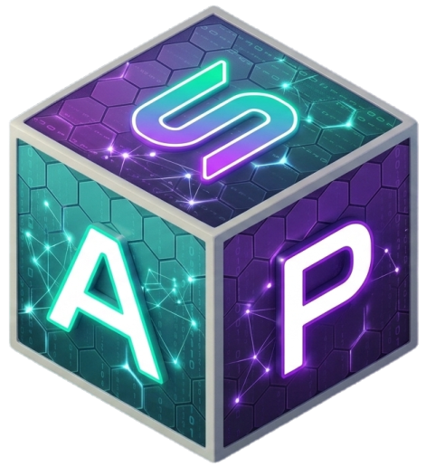

# SAP Frontend

<p align="center">
  
</p>

<p align="center">
  <b>Solana Analytics Platform Powered by Grounded AI</b><br/>
  Semantic Knowledge Graph • Natural Language Analytics • Explainable Insights • Interactive Dashboards
</p>

**sap-frontend** is the **React/Vite single-page application (SPA)** for the
**Solana Analytics Platform (SAP)**, an analytics environment focused on
natural-language exploration of Solana data, explainable insight generation,
semantic querying, and interactive artifact-driven dashboards.

SAP Frontend builds on the reusable frontend foundations of CAP while evolving
the product into a **Solana-focused analytics interface** centered on:

- natural-language investigation
- ontology-backed knowledge graph exploration
- explainable charts, tables, and derived artifacts
- streaming analytics UX
- user-centric dashboards and sharing workflows

<!-- <table align="center" style="border-collapse: collapse; border: none;">
  <tr style="border: none;">
    <td style="border: none; padding: 10px;">
      
    </td>
    <td style="border: none; padding: 10px;">
      
    </td>
  </tr>
  <tr style="border: none;">
    <td style="border: none; padding: 10px;">
      
    </td>
    <td style="border: none; padding: 10px;">
      
    </td>
  </tr>
</table> -->

<br>

---

## Key Capabilities

### Natural Language Analytics

- Natural language → structured analytics workflow
- Real-time streaming responses
- Automatic chart/table detection from structured results
- Explainable intermediate and final outputs
- Reusable conversation and artifact flow

### Dashboards & Artifacts

- Pin query results to dashboards
- Interactive chart and table rendering
- Shareable artifacts and visual outputs
- Widget organization, settings, and categorization
- Reusable artifact specifications across pages

### Semantic Querying & Grounded Insights

- Knowledge-graph-backed analytics UX
- Structured semantic layer for better reasoning
- Explainable results grounded in data
- Support for multi-step investigation workflows

### Authentication & Identity

- Email/password authentication
- Google OAuth login
- Shared auth/session model across the app
- Secure authenticated API requests

### Multilingual UX

- i18n support (EN + PT-BR by default)
- Consistent translation across user-facing flows
- Easy extension for additional languages

### System Monitoring

- Live service/sync indicators
- Health-aware query UX
- Auto-polling with in-flight protection

### Navigation & Layout

- Responsive header + sidebar
- Desktop and mobile analytics workflows
- Shared shell across landing, dashboard, analyses, and settings
- Toasts, deep links, and reusable navigation patterns

---

## Project Structure

```text
sap-frontend/
├── public/                  # Static assets, icons, videos, manifest
├── src/
│   ├── components/          # Shared UI, navigation, artifacts, welcome surface
│   │   ├── artifacts/
│   │   ├── dashboard/
│   │   ├── landing/
│   │   ├── auth/
│   │   └── welcome/
│   ├── hooks/               # Auth, streaming, sync status, conversations
│   ├── locales/             # Translation files
│   ├── pages/               # Welcome, Landing, Dashboard, Analyses, Settings
│   ├── styles/              # Global and feature-specific CSS
│   ├── utils/               # Sharing, charts, polling, helpers
│   ├── index.jsx            # App entry, routing, providers
│   └── ...
├── docs/
├── package.json
├── vite.config.mjs
└── README.md
```

### Environment Variables

Vite loads environment variables automatically depending on the mode:

| File               | When It Loads           | Purpose                         |
| ------------------ | ----------------------- | ------------------------------- |
| `.env`             | Always                  | Baseline defaults for all modes |
| `.env.local`       | Always (ignored by Git) | Local machine overrides         |
| `.env.development` | `npm run dev`           | Development-only overrides      |
| `.env.production`  | `npm run build`         | Production build settings       |

Example:

```VITE_API_URL=http://localhost:8000/api
VITE_GOOGLE_CLIENT_ID=xxxx.apps.googleusercontent.com
VITE_ENV_LABEL=DEV
VITE_SAP_OFFLINE=false
```

Adjust actual values to match your backend and local environment.

## Getting Started

### Prerequisites

- Node.js 24 LTS recommended
- npm

### Installation

```git clone git@github.com:mobr-ai/sap-frontend.git
cd sap-frontend

npm install
npm run dev
```

The app will run at:

http://localhost:5173

### Building for Production

```
npm run build
```

This generates a static production bundle in:

```
dist/
```

### Current Migration Notes

SAP Frontend started from the open-source CAP frontend and is being migrated
incrementally.

Current direction:

- keep the app buildable throughout
- preserve the reusable chain-agnostic frontend core
- isolate and phase out Cardano-specific assumptions
- evolve the UX toward Solana-native analytics and semantic investigation

This means some legacy implementation details may still exist internally while
the visible product and shared shell are being actively refactored toward SAP.

## Related Repositories

- SAP Frontend
  React/Vite SPA for the Solana Analytics Platform
- CAP Frontend
  The original frontend base used for migration and reusable UI patterns
- MOBR Systems
  Open-source analytics, AI, and knowledge-graph infrastructure work:
  `https://github.com/mobr-ai`

## Tech Stack

- React + Vite — SPA tooling
- React Router — routing
- React Bootstrap — UI components
- Vega-Lite / vega-embed — chart rendering
- i18next — localization
- Custom analytics/artifact utilities — reusable chart/table workflows

## Contributing

Contributions are welcome, especially in these areas:

- Solana-first UX refinement
- artifact and dashboard improvements
- semantic analytics workflows
- bundle cleanup and legacy dependency isolation
- accessibility and mobile polish
- translation quality and consistency

When contributing:

1. Create a feature branch
2. Keep changes scoped and buildable
3. Run a production build before opening a PR
4. Include screenshots for meaningful UI changes

## License

Licensed under the GNU GPLv3.
You may use, modify, and distribute the software under the same license.
