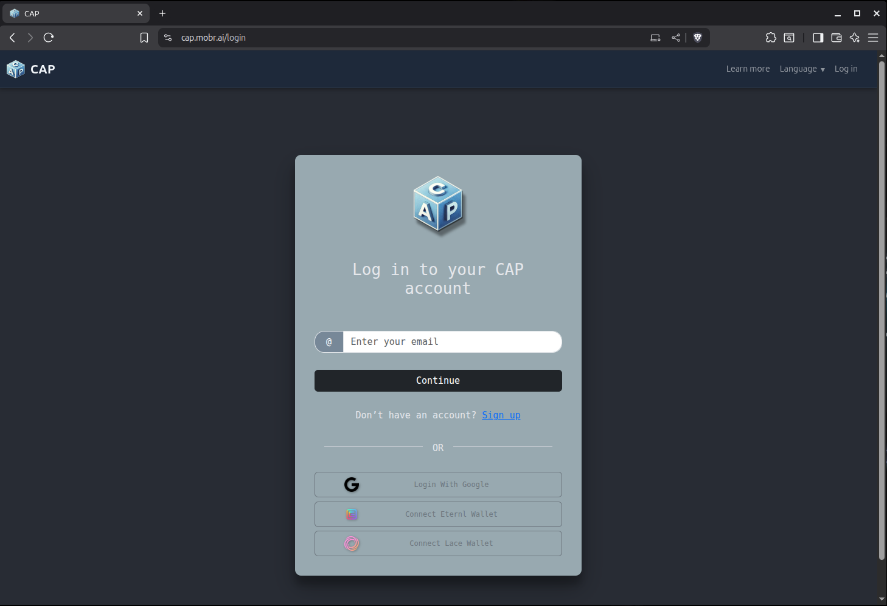
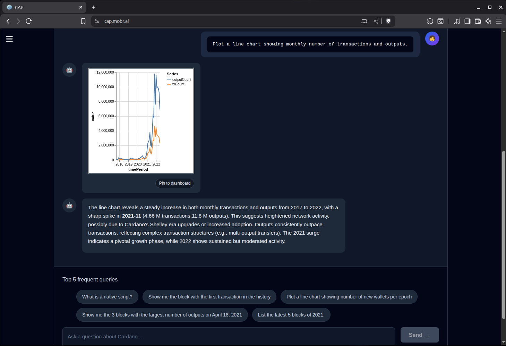
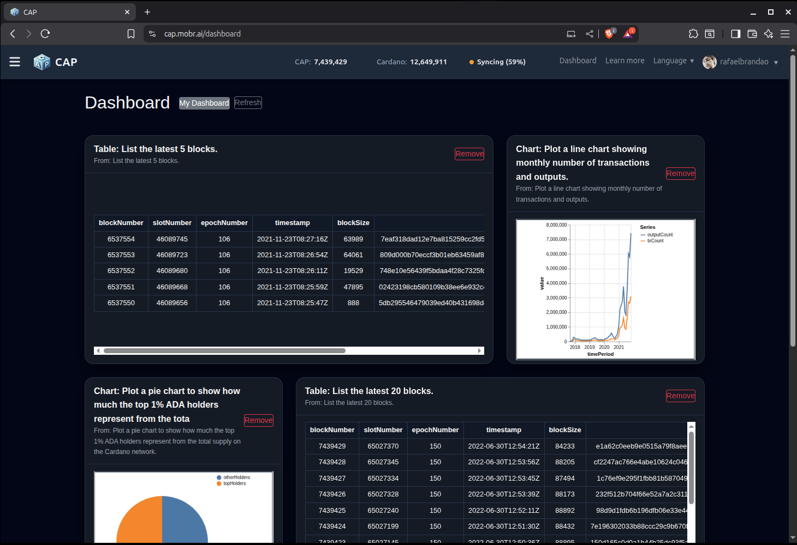
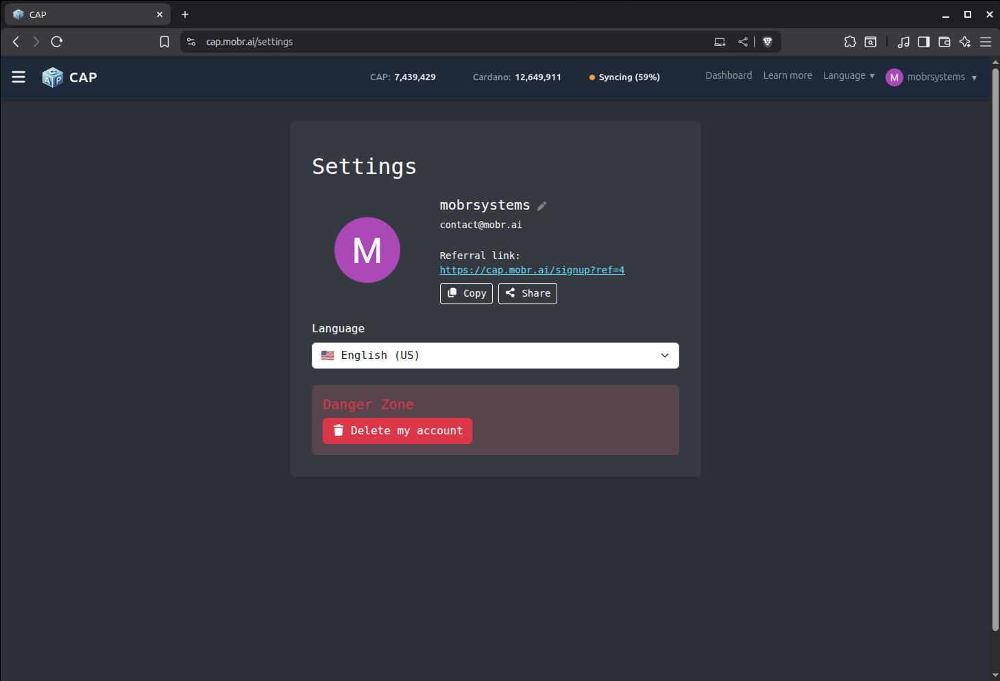

# SAP Frontend Guide

**Solana Analytics Platform — User & Developer Documentation**

This guide explains how to use, customize, and extend the **SAP Frontend**,
the React/Vite interface for natural-language Solana analytics, semantic
querying, dashboards, and artifact-driven exploration.

---

# Table of Contents

1. [Overview](#overview)
2. [User Guide](#user-guide)
   - [Signing In](#signing-in)
   - [Welcome Experience](#welcome-experience)
   - [Landing Page](#landing-page)
   - [Natural Language Queries](#natural-language-queries)
   - [Interpreting Results](#interpreting-results)
   - [Artifacts (Tables & Charts)](#artifacts-tables--charts)
   - [Pinning Items to Dashboard](#pinning-items-to-dashboard)
   - [Dashboard Usage](#dashboard-usage)
   - [Settings Page](#settings-page)
3. [Developer Guide](#developer-guide)
   - [Project Structure](#project-structure)
   - [Environment Variables](#environment-variables)
   - [Running Locally](#running-locally)
   - [API Dependencies](#api-dependencies)
   - [Key Hooks & Components](#key-hooks--components)
   - [Artifacts Architecture](#artifacts-architecture)
   - [Dashboard Architecture](#dashboard-architecture)
   - [Migration Context](#migration-context)
4. [Internationalization](#internationalization)
5. [Styling & Theming](#styling--theming)
6. [Contributing](#contributing)

---

# Overview

The **SAP Frontend** is a React/Vite SPA that provides:

- natural-language analytics for Solana-focused workflows
- streaming AI-assisted query experiences
- interactive charts and tables
- reusable dashboards built from saved artifacts
- multilingual UX (EN + PT-BR)
- service/sync awareness in the shared shell
- responsive layouts for desktop and mobile usage

SAP Frontend is being evolved from the reusable core of CAP Frontend, with the
goal of becoming a clean **Solana-first analytics product** rather than a
surface-level reskin.

---

# User Guide

## Signing In

SAP currently supports:

1. **Email + Password**
2. **Google OAuth**

The frontend preserves a shared authentication/session model across the app.

<!-- <p align="center">
  
</p> -->

---

## Welcome Experience

The Welcome page introduces the SAP product positioning and serves as the main
entry point into the application.

It combines:

- a hero section
- sign-in / sign-up flow
- animated video surface
- architecture/feature showcase
- progressive reveal on scroll

This page is intended to communicate SAP’s core value clearly before the user
enters the analytics workspace.

---

## Landing Page

After sign-in, users are taken to the main analytics workspace where they can
ask questions in natural language and receive streamed answers, charts, tables,
and derived artifacts.

Examples of supported investigation styles:

- “Show the latest 5 blocks on Solana”
- “Compare validator activity with the largest recent stake movement”
- “Summarize notable on-chain changes across Solana this week”
- “Plot recent token activity across major Solana programs”

<!-- <p align="center">
  
</p> -->

Key elements:

- natural-language input
- streamed response area
- charts/tables rendered from structured results
- sidebar conversation history
- artifact actions such as sharing and pinning

---

## Natural Language Queries

The frontend supports a streaming analytics workflow:

1. The user enters a request
2. The backend interprets and plans the query
3. Structured results are returned
4. The frontend detects renderable artifacts
5. Charts, tables, and narrative outputs are displayed together

Features include:

- incremental streamed text
- markdown rendering
- chart/table auto-detection
- reusable artifact actions
- conversation persistence and reload

---

## Interpreting Results

Responses may include:

- narrative explanation
- structured artifact data
- tables
- chart-ready results
- dashboard-pin-ready outputs

The frontend is responsible for turning structured result payloads into clear,
reusable visual artifacts.

---

## Artifacts (Tables & Charts)

Artifacts support:

- responsive rendering
- chart/table display
- sharing
- dashboard pinning
- reusable metadata/config payloads
- visual consistency across landing and dashboard contexts

---

## Pinning Items to Dashboard

Any compatible artifact can be pinned to a dashboard.

Typical flow:

1. User reviews an artifact
2. User clicks **Pin to dashboard**
3. A toast confirms the action
4. The dashboard can be opened directly
5. The widget persists as a saved artifact-based element

---

## Dashboard Usage

<!-- <p align="center">
  
</p> -->

Dashboard features include:

- pinned widgets
- configurable widget metadata
- responsive widget layout
- chart expansion and interaction
- persistent saved state

Widgets are based on saved artifacts rather than raw query state, which makes
them easier to reuse, revisit, and share.

---

## Settings Page

<!-- <p align="center">
  
</p> -->

Settings currently support or prepare for:

- language selection
- profile metadata
- general user preferences
- account-level actions

---

# Developer Guide

## Project Structure

```text
src/
├── components/
│   ├── artifacts/        # Charts, tables, renderers
│   ├── auth/             # Auth shell and panels
│   ├── dashboard/        # Grid, widgets, settings
│   ├── landing/          # Query UX components
│   ├── welcome/          # Welcome hero/showcase
│   └── ...
├── hooks/
│   ├── useAuthRequest.js
│   ├── useLLMStream.js
│   ├── useLandingStreamManager.js
│   ├── useConversations.js
│   ├── useSyncStatus.js
│   └── ...
├── locales/
│   ├── en/
│   └── pt/
├── pages/
│   ├── WelcomePage.jsx
│   ├── LandingPage.jsx
│   ├── DashboardPage.jsx
│   ├── AnalysesPage.jsx
│   ├── SettingsPage.jsx
│   └── ...
├── styles/
│   ├── landing/
│   ├── welcome/
│   └── ...
├── utils/
│   ├── share/
│   ├── kvCharts/
│   └── ...
└── index.jsx
```

---

## Environment Variables

Vite loads variables depending on the mode:

| File               | Used In         | Notes                   |
| ------------------ | --------------- | ----------------------- |
| `.env`             | All modes       | Baseline values         |
| `.env.local`       | Local only      | Secrets; ignored by Git |
| `.env.development` | `npm run dev`   | Dev-only overrides      |
| `.env.production`  | `npm run build` | Production settings     |

Typical variables:

```env
VITE_API_URL=http://localhost:8000/api
VITE_GOOGLE_CLIENT_ID=...
VITE_ENV_LABEL=DEV
VITE_SAP_OFFLINE=false
```

Adapt these to your local backend and deployment model.

## Running Locally

```
npm install
npm run dev
```

Frontend runs on:

```
http://localhost:5173
```

To produce a production build:

```
npm run build
```

## API Dependencies

The frontend expects backend support for:

- authentication and session endpoints
- analytics and query endpoints
- dashboard CRUD flows
- artifact and sharing-related operations
- service and sync status reporting

Exact endpoint details may evolve during the SAP migration as chain-specific CAP assumptions are removed and Solana-focused services mature.

## Key Hooks & Components

### Hooks

- useAuthRequest — authenticated request layer
- useLLMStream — streamed response handling
- useLandingStreamManager — landing-page query orchestration
- useConversations — conversation loading and state updates
- useSyncStatus — service and sync health polling

### Components

- WelcomeShowcase — SAP product and architecture marketing surface
- NavBar / Header / NavigationSidebar — shared shell
- VegaChart — chart renderer
- DashboardGrid — widget layout container
- DashboardWidget — saved artifact wrapper
- ShareModal — sharing UI for artifacts and analyses

## Artifacts Architecture

The frontend uses a structured artifact model so results can be rendered consistently across chat-like landing flows and dashboards.

Artifacts generally carry:

- result type
- data payload
- metadata
- share and display information
- optional visualization config

This allows tables and charts to be:

- rendered consistently
- pinned to dashboards
- shared externally
- reopened later with preserved meaning

## Dashboard Architecture

Dashboard widgets are based on saved artifacts and layout metadata.

The frontend is responsible for:

- widget rendering
- layout behavior
- widget settings
- visual ordering
- share and export behavior

As SAP evolves, the dashboard layer remains one of the key reusable assets from the original CAP frontend codebase.

## Migration Context

SAP Frontend is being migrated incrementally from CAP Frontend.

Working principles:

- keep the app buildable at every step
- prefer incremental refactors over a rewrite
- reuse chain-agnostic frontend infrastructure
- move toward a Solana-first product and IA/UX model

This means some legacy internals may still exist temporarily while the visible product, shared shell, and interaction model are being actively aligned to SAP.

## Internationalization

Translations live under:

```
src/locales/
```

Current default languages:

- English
- Brazilian Portuguese

All UI strings should go through t(...).

When adding new user-facing features:

- add EN and PT-BR entries together
- avoid hardcoded copy unless it is a deliberate temporary fallback during migration
- keep terminology consistent across welcome, landing, dashboard, and share flows

## Styling & Theming

SAP uses:

- React-Bootstrap as a base UI layer
- custom CSS in src/styles/
- shared app-\* namespace for generic shell and layout styling
- feature-specific styles for landing, dashboard, and welcome flows

Current visual direction:

- dark premium shell
- tight spacing and smooth motion
- glassy panels and soft gradients
- progressive reveal behavior on the Welcome experience

## Contributing

1. Create a feature branch
2. Keep changes scoped and buildable
3. Run a production build before opening a PR
4. Include screenshots for meaningful UI changes
5. Prefer migration-friendly refactors over large rewrites

Areas especially worth improving:

- Solana-first product copy
- artifact and dashboards UX
- bundle cleanup and code-splitting
- legacy dependency isolation
- accessibility and responsive polish
